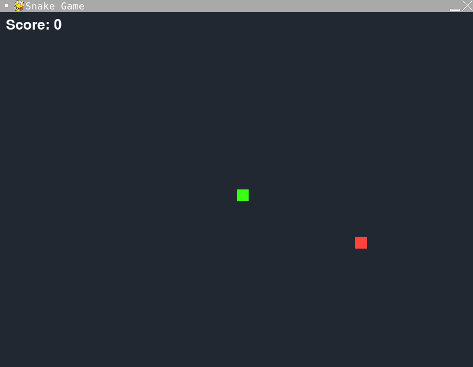

# 🐍 Snake Game

This project was created during the **Prompt Engineering Bootcamp by Zero to Mastery**. The goal was to prompt an AI assistant (ChatGPT) to build a classic Snake Game in Python using Pygame. This task was part of learning to construct clear, specific prompts for AI tools.

---

## 📝 Project Overview

The Snake Game is a simple, retro-inspired game where players control a snake to collect food, growing longer with each item consumed. The challenge increases as the snake's length grows, making it harder to avoid collisions with itself or the screen boundaries.

**Features:**
- Visually appealing, dark-themed interface.
- Customizable speed and colors.
- Friendly game-over message: _"Game Over! Womp Womp."_

---

## 💬 Prompts Used to Create the Game

Below are the prompts I used during the development process. These demonstrate how step-by-step instructions were provided to guide the AI in creating the game:

1. **Initial Inquiry**:
   > I would like to make a snake game in Python. Provide the steps necessary.

2. **Implementation Request**:
   > Now go ahead and implement all of these steps with Python code.

3. **Enhancements**:
   > Make the game fancier, use better eye-friendly colors, and update the text to:  
   > "Game Over! Womp Womp. Press Q to quit or C to play again."

---

## 🎮 How to Play

1. Clone this repository:
   ```bash
   git clone https://github.com/joesaistuff/snake-game.git
   cd snake-game
   ```

2. Install Pygame if not already installed:
   ```bash
   pip install pygame
   ```

3. Run the game:
   ```bash
   python snake_game.py
   ```

## 🎛️ Controls

- **Arrow keys**: Move the snake.  
- **C**: Restart the game after losing.  
- **Q**: Quit the game.  

## 📸 Screenshots

Here's a preview of the Snake Game:



Enjoy controlling the snake while collecting food and avoiding collisions!

---

## 💡 Key Takeaways

This project taught me:  
- How to construct clear prompts for AI tools to build functional programs.  
- The fundamentals of designing and enhancing a Python game using Pygame.  
- The importance of iteration to refine outputs and create user-friendly features.  

---

## 👨‍💻 About Me

I am **Joe-Manuel Schlüter**, an AI enthusiast exploring the potential of AI tools through practical projects like this one.

